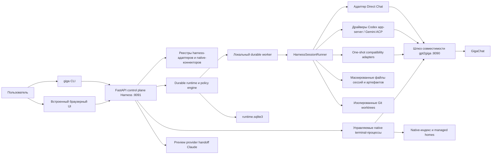
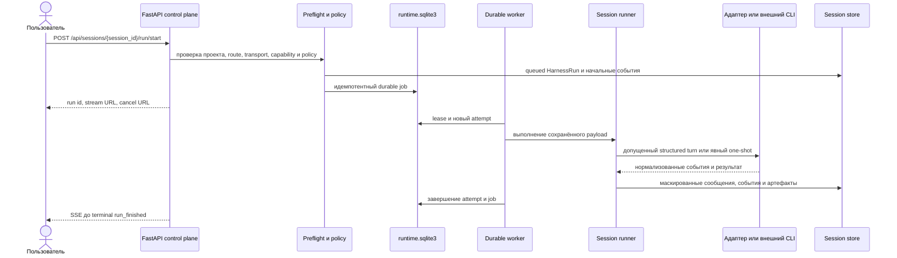
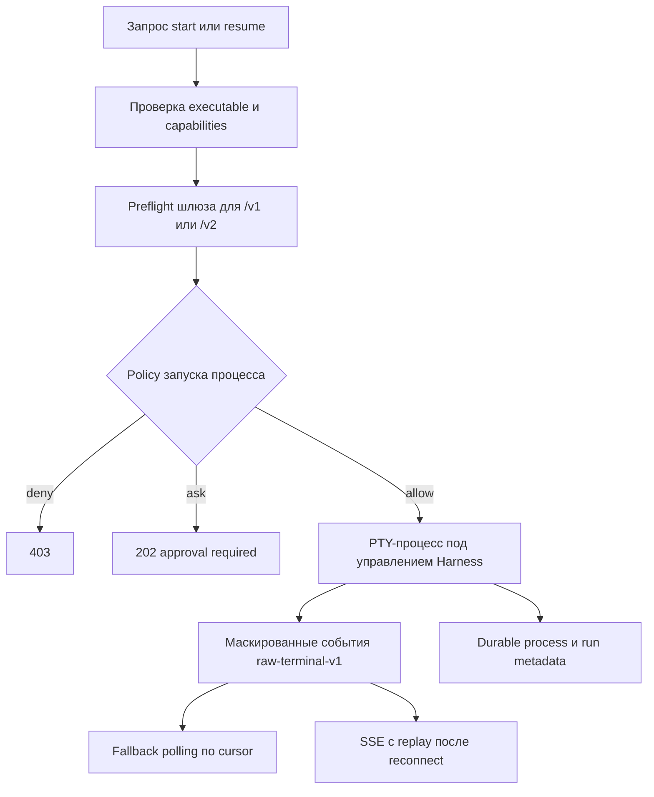

# Архитектура Unified Harness

Unified Harness — локальный управляющий слой для работы с агентами. Он не
реализует модельный протокол и не заменяет `gpt2giga`, Codex CLI, Claude Code
или Gemini CLI. Harness выбирает адаптер выполнения, применяет локальные
политики, сохраняет нормализованную запись запуска и показывает это состояние
через CLI `giga` и браузерный cockpit.

UI API — альфа-версия локального control-plane API. Он не входит в публичный
OpenAI-, Anthropic- или Gemini-совместимый контракт шлюза. Описанные здесь
маршруты по умолчанию обслуживает `giga ui` на `127.0.0.1:8091`, а совместимые
с модельными API маршруты отдельно обслуживает `gpt2giga` на порту `8090`.

## Системный контекст

Главная граница проходит между оркестрацией и выполнением. Harness может
применять политики к операциям, которыми владеет: запуску процесса, подключению
к MCP-серверу или применению патча. Он не может восстановить скрытые вызовы
инструментов или решения о разрешениях внутри непрозрачного TUI стороннего CLI.

## Основные компоненты

| Компонент | Зона ответственности | Зачем нужен |
| --- | --- | --- |
| `ui/app.py` и `ui/routers/` | Композиция FastAPI, аутентификация, JSON/SSE API, встроенный статический UI | Дают CLI и браузеру единую локальную поверхность управления. |
| `registry.py`, `plugins.py`, `harnesses/` | Обнаружение встроенных адаптеров и адаптеров из entry points | Позволяют расширять набор исполнителей без хардкода каждого из них во frontend. |
| `execution.py`, `structured_sessions.py`, `structured_processes.py` | Provider-neutral execution identity, structured-session links, ограниченный JSON-RPC supervision | Явно разделяют transport, interaction mode, runtime ownership, provider identity и recovery evidence. |
| `session_runner.py`, `runtime/structured.py` | Валидация запроса, capability-based durable admission, вызов адаптера, нормализованное сохранение | Даёт structured и one-shot адаптерам общих владельцев session/run/event, не выдавая terminal или handoff за structured execution. |
| `sessions/` | Сессии, запуски, сообщения, события, raw records, маскирование | Сохраняет пригодную для проверки историю после перезапуска браузера или сервера. |
| `runtime/` | Durable jobs, attempts, leases, workers, retries, cancellation, approvals | Отделяет отправленную задачу от HTTP-запроса браузера, который её создал. |
| `native/` | Обнаружение native history и жизненный цикл принадлежащих Harness PTY-процессов | Сохраняет продолжение native CLI-сессий, не изменяя пользовательские vendor homes. |
| `attachments/`, `generated_files.py` | Загруженные файлы, ссылки на workspace и сгенерированные файлы | Передаёт адаптерам ограниченные типизированные файлы и безопасные preview. |
| `project.py`, `project_memory.py`, `workspace.py` | Идентичность проекта, конфигурация `.giga/`, memory, ограниченное чтение файлов | Отделяет переиспользуемые определения проекта от локальной runtime-истории машины. |
| `worktrees.py`, `pr_artifacts.py`, `promotions.py` | Изолированные изменения, patch/branch-артефакты, перенос результата в project YAML | Делает изменения проверяемыми и останавливает их при неполных проверках. |
| `tools/`, `mcp.py`, `managed_mcp.py` | Tool profiles, разрешение секретов, MCP discovery, managed CLI config | Подключает инструменты без записи секретов в публичные записи или vendor homes. |
| `agents.py`, `workflows.py`, `schedules.py`, `evals.py` | Переиспользуемые профили и высокоуровневая оркестрация | Строит повторяемую автоматизацию поверх того же durable run-примитива. |

## Поток durable-выполнения

Обычная кнопка Run в Workbench и `giga session turn` используют асинхронный
durable path. Для совместимых Codex и Gemini Workbench по умолчанию выбирает
`native_structured`; `one_shot` остаётся явным compatibility-вариантом.
Синхронные `/run` и прямая команда `giga harness run` полезны для коротких
probes, но не получают durable structured-session owner.

Job, attempt и run намеренно являются разными записями:

- **session** — видимый пользователю контейнер разговора или задачи;
- **run** — одно выполнение адаптера и сохранённые доказательства этого запуска;
- **job** — durable-запись планирования и отмены;
- **attempt** — одна worker lease этого job, сохраняющая историю retry.

Неизменяемый execution snapshot хранит `native_structured`, `native_terminal`
или `one_shot` независимо от interactive/batch mode и request-bound/durable
ownership. Durable admission требует reviewed structured driver с событиями,
interrupt, resume, recovery после потери процесса и approval path. Ошибка
admission не переключает transport. Codex использует app-server JSON-RPC v2,
совместимый Gemini — ACP; Claude embedded structured execution остаётся blocked.

## Поток native terminal

`native_terminal` отделён от structured и one-shot execution. Harness владеет
PTY-процессом и его
маскированным потоком байтов, но внутренним поведением TUI владеет CLI. Новая или
возобновляемая сессия проходит capability checks и route-aware preflight шлюза.
Вывод доступен через polling по cursor и SSE. `Last-Event-ID` или `after_seq`
позволяет ограниченно воспроизвести поток после reconnect. Resize и input
выделены в отдельные операции, потому что изменяют живой терминал.

## Provider-owned handoff

Claude Remote Control/Desktop handoff — отдельная поверхность, а не
`ExecutionTransport`. `GET /api/provider-handoffs/{harness_id}/preview`
возвращает только content-free launch instruction после capability, platform и
workspace checks. Handoff требует provider login, может открыть provider-owned
process/UI и явно не является durable, queueable или resumable через Harness
structured-session link. Отклонённый embedded Claude SDK path остаётся blocked,
а не переименовывается в handoff или terminal execution.

## Границы состояния и безопасности

Принадлежащая проекту конфигурация, которую можно хранить вместе с кодом, лежит
в `.giga/`. Локальное runtime-состояние машины по умолчанию находится в
`~/.gpt2giga/harness` и не должно копироваться в репозиторий. Точная раскладка
может меняться в альфа-версии, но граница владения остаётся той же:

| Состояние | Типичное расположение | Контракт |
| --- | --- | --- |
| Agents, workflows, evals, schedules, prompts, project defaults | `<project>/.giga/` | Проверяемая конфигурация проекта без секретов. |
| Durable coordination | `~/.gpt2giga/harness/runtime.sqlite3` | Версионируемая SQLite-схема с WAL, миграциями, leases, approvals и audit history. |
| Sessions, events, raw records, attachments, arenas, eval results | `~/.gpt2giga/harness/...` | Маскирование до записи и ограниченная сериализация в API. |
| Локальный UI-доступ | `~/.gpt2giga/harness/ui_access/state.json` | Только приватные server-side хэши и сроки с режимом `0600`; browser cookies и значения доступа здесь не сохраняются. |
| Удалённый UI-доступ | `~/.gpt2giga/harness/ui_access/remote_state.json` | Приватные `0600` digests transactions/sessions, стабильные actor IDs, роли, сроки и revocation evidence; OAuth material не сохраняется. |
| Native reference index и managed CLI homes | `~/.gpt2giga/harness/native/...` | Harness пишет только в свои managed homes, но не в пользовательский native vendor home. |
| Изолированные edit worktrees | `~/.gpt2giga/harness/worktrees/...` | Применение только после policy, approval, base-commit и dirty-tree checks. |

UI по умолчанию слушает только loopback. Первый OS-local claim, expiry, logout,
rotation, recovery, same-origin checks и CSRF marker сохраняют opaque
server-side browser-session boundary без локального `.env` token. `/healthz`
намеренно минимален и не требует аутентификации. Remote bind допускает только
реализованный [single-issuer OIDC/BFF контракт](remote-ui-identity-adr.md) с
полной статической конфигурацией и явным CLI opt-in. Legacy bootstrap token,
Host allowlist и retired bearer exchange не аутентифицируют remote users.
Секреты и скрытые reasoning-данные удаляются до сохранения и повторно перед
выбранными API-ответами.

## API управляющего слоя

Таблицы ниже описывают все смонтированные JSON- и SSE-маршруты. SPA-маршруты UI
и `/assets/*` только отдают встроенные frontend-файлы и не являются data API.
JSON-схема FastAPI доступна по `/openapi.json`; Swagger и ReDoc намеренно
отключены.

### Shell, discovery и preflight

| Маршруты | Зачем нужны |
| --- | --- |
| `GET /healthz` | Минимальная liveness-проверка без данных проекта или runtime. |
| `GET /auth/status` `POST /auth/logout` `POST /auth/local/rotate` | Возвращает content-free состояние browser session и выполняет аутентифицированный logout или loopback rotation. |
| `POST /auth/local/recover` | Завершает явное same-origin loopback recovery и отзывает старые локальные сессии; token не принимается в URL или форме. |
| `GET /api/health` | Возвращает аутентифицированному UI расширенную готовность cockpit, proxy, runtime и reconciliation. |
| `GET /api/defaults` | Передаёт UI безопасные начальные значения model, API mode, timeout и других настроек. |
| `GET /api/settings` `PATCH /api/settings/defaults` | Читают backend-owned Workbench defaults или валидируемо обновляют default harness, route/model, canonical execution transport, compatibility invocation field, mode и workspace policy. |
| `GET /api/harnesses` | Перечисляет встроенные и plugin-адаптеры, их availability, capabilities, native support и compatibility evidence. |
| `GET /api/models` | Даёт model picker безопасный список моделей, не заставляя браузер обращаться к шлюзу напрямую. |
| `POST /api/preflight/run` | Проверяет prompt, workspace, attachments, route, executable и блокирующие условия до отправки. |
| `GET /api/compatibility/guardian` | Запускает bounded offline fixtures для окон native CLI, provider protocols, версий SDK/schema и marketplace contracts без запуска providers или integrations. |
| `POST /api/route/recommendation` | Детерминированно рекомендует harness/mode; не вызывает LLM и не выдаёт edit-разрешение. |

### Project, workspace, memory и редактор

| Маршруты | Зачем нужны |
| --- | --- |
| `GET /api/project` `GET /api/project/config` | Определяют идентичность проекта и отдельно возвращают безопасную конфигурацию `.giga/`. |
| `POST /api/project/init` | Создаёт стартовые определения без секретов и без молчаливой замены существующих файлов. |
| `GET /api/project/presets` `POST /api/project/presets/{preset_name}/render` | Перечисляют prompt presets и рендерят выбранный preset после валидации входов. |
| `GET /api/project/state` `PATCH /api/project/state` | Читают и обновляют небольшие UI-настройки вроде последней session; это не конфигурация исходного кода проекта. |
| `GET /api/project/memory` `POST /api/project/memory` `PATCH /api/project/memory/{memory_id}` `DELETE /api/project/memory/{memory_id}` | Управляют явными project notes с валидацией и маскированием вместо скрытого извлечения памяти из истории. |
| `GET /api/workspace/tree` `GET /api/workspace/file/metadata` | Дают ограниченное safe-path discovery для `@file` и preview без произвольного чтения файловой системы. |
| `POST /api/editor/open-workspace` `POST /api/editor/open-file` `POST /api/editor/open-diff` `POST /api/editor/open-terminal` | Открывают разрешённый путь или команду в локальном редакторе после path/workspace checks. |

### Sessions, attachments и file preview

| Маршруты | Зачем нужны |
| --- | --- |
| `GET /api/sessions` `POST /api/sessions` | Перечисляют контейнеры задач или создают пустую session до первого run. |
| `GET /api/sessions/{session_id}` `PATCH /api/sessions/{session_id}` `DELETE /api/sessions/{session_id}` | Загружают полный bundle, меняют title/archive state или удаляют принадлежащую Harness историю. |
| `POST /api/sessions/run` `POST /api/sessions/{session_id}/run` | Синхронные create-and-run/run-in-session пути совместимости для коротких вызовов. |
| `POST /api/sessions/run/start` `POST /api/sessions/{session_id}/run/start` | Основные асинхронные пути: сразу возвращают durable run, stream и cancel identifiers. |
| `GET /api/sessions/{session_id}/events` | Читает сохранённые маскированные события после refresh или без streaming. |
| `GET /api/cockpit/sessions` `GET /api/cockpit/sessions/{session_id}` | Возвращают ограниченные indexed summaries и лёгкий Workbench overview вместо полного retained bundle. |
| `GET /api/cockpit/sessions/{session_id}/messages` `GET /api/cockpit/sessions/{session_id}/runs` `GET /api/cockpit/sessions/{session_id}/events` `GET /api/cockpit/sessions/{session_id}/artifacts` | Независимо читают bounded projections, чтобы большая история не раздувала initial UI state. |
| `GET /api/cockpit/sessions/{session_id}/messages/{message_id}/content` | Загружает полный retained message только для явных copy/edit actions; list projection остаётся ограниченным. |
| `GET /api/cockpit/sessions/{session_id}/updates/stream` | Передаёт content-free revisions по SSE и требует resnapshot при backpressure. |
| `POST /api/sessions/{session_id}/attachments` `POST /api/sessions/{session_id}/attachments/workspace` | Добавляют загруженные bytes или проверенную workspace-ссылку. |
| `GET /api/sessions/{session_id}/attachments` | Перечисляет attachment metadata для следующих запусков session. |
| `GET /api/sessions/{session_id}/attachments/workspace/search` | Ищет bounded safe-path candidates для attachment picker без выдачи содержимого файлов. |
| `GET /api/attachments/{attachment_id}/metadata` `GET /api/attachments/{attachment_id}` `DELETE /api/attachments/{attachment_id}` | Разделяют дешёвое metadata-чтение, ограниченную выдачу blob и удаление данных Harness. |
| `GET /api/files/preview` `GET /api/files/generated/{run_key}/{filename}` | Отдают разрешённые local previews и generated artifacts без раскрытия произвольных путей. |

Асинхронные run-start endpoints принимают необязательный `side_effect_token`
для ограниченного recovery checkpoint. До сохранения durable payload Harness
заменяет его на SHA-256 identity, записывает одно фиксированное Harness-owned
событие через transactional outbox и после потери owner переиспользует то же
completion evidence. Незавершённая reservation завершается безопасным отказом;
этот контракт не разрешает retry произвольных edit, shell, filesystem или
network effects.

### Runs, durable runtime, streaming и review artifacts

| Маршруты | Зачем нужны |
| --- | --- |
| `GET /api/runs` | Возвращает Runs Center с cursor pagination по durable jobs, attempts, status groups и workers. |
| `GET /api/runs/updates/stream` | Публикует content-free revisions Runs Center по SSE без full-list polling. |
| `GET /api/runs/{run_id}` `GET /api/runs/{run_id}/summary` | Разрешают run в полный persisted bundle или лёгкую durable summary. |
| `GET /api/cockpit/runs/{run_id}` `GET /api/cockpit/runs/{run_id}/raw` `GET /api/cockpit/runs/{run_id}/diff` `GET /api/cockpit/runs/{run_id}/report` | Сначала загружают bounded Cockpit overview, а raw/diff/report projection — только по явному открытию. |
| `GET /api/runs/{run_id}/trace` `GET /api/runs/{run_id}/events/{event_id}` | Держат trace list лёгким и загружают уже маскированный payload только при раскрытии события. |
| `GET /api/runs/{run_id}/events/stream` | Передаёт сохранённые события через SSE, поддерживает resume по cursor и завершается после `run_finished`. |
| `POST /api/runs/{run_id}/cancel` | Сохраняет намерение отмены, чтобы worker остановился и после отключения браузера. |
| `POST /api/runs/{run_id}/retry` | Повторно ставит в очередь только failed job с retry-safe idempotency class последнего attempt. |
| `GET /api/runs/{run_id}/provenance` | Возвращает adapter, route, binary/schema evidence, request hashes и безопасные metadata для воспроизводимости. |
| `GET /api/runs/{run_id}/support-bundle` | Возвращает content-free redaction-safe diagnostics одного run; это не формат private state backup. |
| `POST /api/runs/{run_id}/replay` `POST /api/runs/{run_id}/fork` | Повторяет безопасно сохранённый запрос в той же session или отделяет историю в новую session. |
| `POST /api/runs/{run_id}/trace-replays/preview` `POST /api/runs/{run_id}/trace-replays` `GET /api/runs/{run_id}/trace-replay` | Показывают content-addressed preview one-axis replay, запускают в новой session только точный проверенный manifest и читают сохранённое сравнение source/destination. |
| `GET /api/runs/{run_id}/handoff-capsule` | Строит bounded content-free snapshot передачи между Harness с identities задачи/evidence, environment, approvals, compatibility и честными ограничениями continuity, не запуская target. |
| `GET /api/runs/{run_id}/diff` `GET /api/runs/{run_id}/patch` `GET /api/runs/{run_id}/pr` | Показывают isolated edit как structured diff, raw patch или PR-ready artifact. |
| `POST /api/runs/{run_id}/apply` `POST /api/runs/{run_id}/branch` | Применяют reviewed patch или создают local branch только после approval и Git safety checks. |
| `POST /api/runs/{run_id}/discard` `POST /api/runs/{run_id}/open-worktree` | Удаляют isolated worktree или открывают его в редакторе, не меняя source checkout. |
| `POST /api/runs/{run_id}/promotions/preview` `POST /api/runs/{run_id}/promotions/apply` | Превращают run output в reviewed project YAML; apply требует review token и ETag/source-hash checks. |
| `POST /api/run` | Низкоуровневый синхронный вызов адаптера для простых probes и совместимости без durable UI lifecycle. |

### Native history и terminal processes

| Маршруты | Зачем нужны |
| --- | --- |
| `GET /api/native/sessions` `POST /api/native/sessions/sync` | Читают cached native refs или обнаруживают vendor CLI history с явной project scope. |
| `GET /api/native/sessions/{native_ref_id}/preview` `POST /api/native/sessions/{native_ref_id}/import` | Показывают маскированный transcript перед импортом в нормализованную историю. |
| `POST /api/sessions/{session_id}/native/link` | Явно связывает Harness session с проверенным native ref, если автоматической корреляции недостаточно. |
| `POST /api/native/processes/start` | Запускает новый или resumed CLI в принадлежащем Harness PTY после capability, route, policy и managed-home checks. |
| `GET /api/native/processes/{process_id}` `DELETE /api/native/processes/{process_id}` | Читают durable process state или запрашивают ограниченную остановку принадлежащей Harness process group. |
| `POST /api/native/processes/{process_id}/input` | Пишет ограниченный input в PTY как отдельную валидируемую и аудируемую мутацию. |
| `GET /api/native/processes/{process_id}/output` | Читает маскированный terminal output по cursor и остаётся fallback при недоступном EventSource. |
| `GET /api/native/processes/{process_id}/output/stream` | Передаёт terminal events, keepalives и replay после reconnect через SSE. |
| `POST /api/native/processes/{process_id}/resize` | Валидирует rows/columns и синхронизирует размер TUI с viewport браузера. |
| `GET /api/provider-handoffs/{harness_id}/preview` | Показывает ограниченную provider-owned handoff instruction без открытия provider state и без заявления durable Harness continuity. |

### Arena, policies, approvals и attention

| Маршруты | Зачем нужны |
| --- | --- |
| `GET /api/arena/runs` `POST /api/arena/runs` `GET /api/arena/runs/{arena_id}` | Перечисляют, создают и читают comparison parent, чьи children являются обычными независимыми durable runs. |
| `GET /api/arena/runs/{arena_id}/events/stream` | Объединяет события child runs в один SSE comparison stream. |
| `POST /api/arena/runs/{arena_id}/turns` `POST /api/arena/runs/{arena_id}/children/{child_index}/retry` | Ставят follow-up turns или retry одного child в очередь, сохраняя explicit transport и structured-session evidence. |
| `GET /api/policy/profiles` | Показывает неизменяемые встроенные решения для interactive, review-every-action и unattended contexts. |
| `GET /api/approvals` `POST /api/approvals/{approval_id}/decision` | Перечисляют durable approval requests и сохраняют allow/deny, после чего job requeue или cancel. |
| `GET /api/attention` `POST /api/attention/read` | Собирают approvals, failed schedules и другие actionable items, сохраняя исходный audit record. |

### Tools и MCP configuration

| Маршруты | Зачем нужны |
| --- | --- |
| `GET /api/tools` `POST /api/tools/sync` | Перечисляют нормализованные tool profiles и обновляют project-derived inventory. |
| `GET /api/tool-servers` `GET /api/tool-servers/{server_id}` | Возвращают маскированные MCP descriptors, adapter compatibility и ограниченную probe history. |
| `POST /api/tool-servers/{server_id}/probe` | Выполняет initialize/capability discovery без tool call; недоверенный process/network access требует approval. |
| `POST /api/tool-config/preview` | Показывает точное маскированное изменение managed CLI home. |
| `POST /api/tool-config/apply` | Применяет только trusted servers с optimistic locking и ownership checks. |
| `POST /api/tool-config/rollback` | Восстанавливает последнюю managed config backup, не меняя native CLI home пользователя. |

### Agents и workflows

| Маршруты | Зачем нужны |
| --- | --- |
| `GET /api/agents` `GET /api/agents/{agent_id}` | Перечисляют валидные profiles и возвращают profile с source и execution-plan evidence. |
| `POST /api/agents/validate` | Валидирует недоверенный profile YAML без записи. |
| `POST /api/agents/{agent_id}/draft` `POST /api/agents/{agent_id}/apply` | Отделяют просмотр маскированного diff от atomic ETag-checked записи. |
| `POST /api/agents/{agent_id}/duplicate` | Показывает независимую копию с новым safe id; применение остаётся явным. |
| `POST /api/agents/{agent_id}/run` | Ставит durable run в очередь с immutable snapshot выбранного profile. |
| `GET /api/workflows` `GET /api/workflows/{workflow_id}` | Перечисляют definitions/runs или возвращают workflow и deterministic plan. |
| `POST /api/workflows/validate` `POST /api/workflows/import` | Валидируют YAML без записи или явно импортируют YAML/built-in template. |
| `PUT /api/workflows/{workflow_id}` `POST /api/workflows/{workflow_id}/duplicate` `GET /api/workflows/{workflow_id}/export` | Обновляют с optimistic locking, создают отдельную копию или экспортируют точный portable YAML. |
| `POST /api/workflows/{workflow_id}/run` `GET /api/workflow-runs/{run_id}` `POST /api/workflow-runs/{run_id}/cancel` | Стартуют с immutable definition snapshot, продвигают/читают durable state или отменяют active children. |
| `GET /api/workflow-runs/{run_id}/handoffs` `POST /api/workflow-runs/{run_id}/handoffs/{step_id}/choose` `POST /api/workflow-runs/{run_id}/handoffs/{step_id}/discard` | Проверяют isolated child patches и явно выбирают или удаляют кандидатов. |
| `POST /api/workflow-runs/{run_id}/merge-queue` `POST /api/workflow-runs/{run_id}/merge-queue/apply` | Готовят объединённый patch без пересечений и применяют его только через auditable `git.apply` approval. |

### Schedules, automation и evaluations

| Маршруты | Зачем нужны |
| --- | --- |
| `GET /api/schedules` `GET /api/schedules/{schedule_id}` | Перечисляют project schedules или возвращают definition, state, будущие UTC instants и occurrence history. |
| `POST /api/schedules/preview` `POST /api/schedules` `PUT /api/schedules/{schedule_id}` `DELETE /api/schedules/{schedule_id}` | Валидируют без записи, создают disabled definition, ставят изменённое расписание на pause и удаляют YAML с сохранением audit history. |
| `POST /api/schedules/{schedule_id}/test-now` `POST /api/schedules/{schedule_id}/enable` `POST /api/schedules/{schedule_id}/pause` `POST /api/schedules/{schedule_id}/resume` `POST /api/schedules/{schedule_id}/run-now` | Требуют safe test точного definition hash перед enable; pause/resume и ручной run используют общий worker/policy path. |
| `GET /api/automation` | Возвращает Automation Center: calendar, recent occurrences, worker health и attention state. |
| `GET /api/evals` `POST /api/evals/{eval_name}/runs` `GET /api/evals/runs/{eval_run_id}` | Перечисляют specs/results, ставят case-by-harness matrix в очередь и читают scorecard. |
| `GET /api/evaluate` `GET /api/evaluate/{eval_name}/matrix` | Строят protocol/quality lab projection и фильтруют несовместимые cells до постановки в очередь. |
| `POST /api/evaluate/runs/{eval_run_id}/cancel` `POST /api/evaluate/runs/{eval_run_id}/baseline` | Отменяют незавершённые matrix jobs или фиксируют завершённый dimensioned baseline. |

## Расширение архитектуры

Новый backend выполнения добавляется как адаптер в `harnesses/` и регистрируется
через provider-neutral entry-point group
`gigaloom.harness_adapters.v1`; `gigaloom.harnesses.v1` остаётся
compatibility alias. Structured или terminal continuity следует объявлять
только когда versioned SDK manifest и conformance evidence доказывают нужный
lifecycle. Новые семейства API должны жить в `ui/routers/`; `ui/app.py` следует
оставлять композицией и ядром session/run flow. Любой новый путь сохранения
обязан маскировать данные до записи, а любая мутация — явно указывать policy
boundary.

Пользовательская настройка и поведение функций описаны в
[руководстве Unified Harness](../harness.md).
