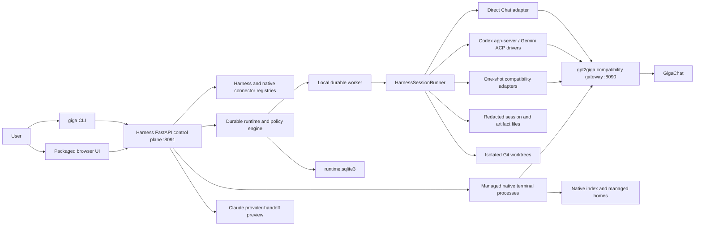
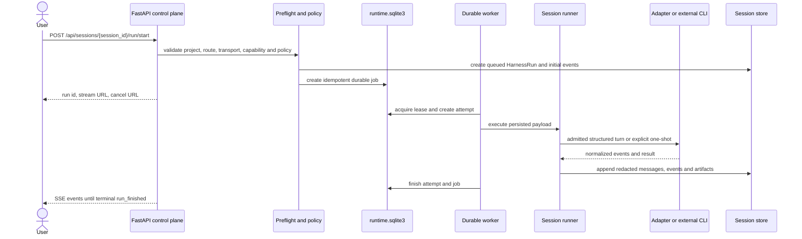
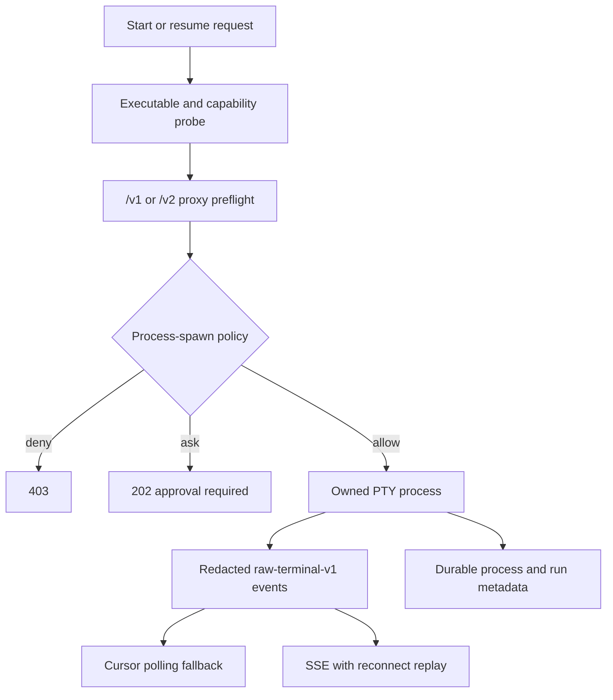

# Unified Harness architecture

Unified Harness is a local control plane for agent work. It does not implement a
model protocol and does not replace `gpt2giga`, Codex CLI, Claude Code, or Gemini
CLI. It chooses an execution adapter, applies local policy, persists a normalized
run record, and exposes that state through the `giga` CLI and the browser cockpit.

The UI API is an alpha, local control-plane API. It is not part of the public
OpenAI-, Anthropic-, or Gemini-compatible gateway contract. Routes described on
this page are served by `giga ui` on `127.0.0.1:8091` by default; model-compatible
routes are served separately by `gpt2giga` on port `8090`.

## 0.9 composition boundaries

The Work surface projects the existing owners into
`Project -> Thread -> Run -> Evidence -> Action`; Inbox, Automations, Library,
and More remain navigation over the same stores. Thread Relay adds bounded
actor/project-scoped read and delivery projections for GigaLoom, pinned Codex
app-server, and ACP threads. It does not own a second transcript, hidden-state
transfer, or autonomous agent network.

Effective Instructions is a read-only Context Manifest/Lens projection.
Attachment decoding adds content-free charset evidence without rewriting source
bytes. Gateway launch overlays bind one immutable route and managed temporary
home to the existing process owner. Local beta reports derive only from
existing durable evidence. These additions are independently disableable and
do not rewrite 0.8.1 sessions or provider-native homes.

## System context

The important boundary is between orchestration and execution. Harness can
enforce policy on operations it owns, such as spawning a process, connecting to
an MCP server, or applying a patch. It cannot reconstruct hidden tool calls or
permission decisions made inside an opaque third-party terminal UI.

## Main components

| Component | Ownership | Why it exists |
| --- | --- | --- |
| `ui/app.py` and `ui/routers/` | FastAPI composition, authentication, JSON/SSE API, packaged static UI | Gives CLI and browser clients one local control-plane surface. |
| `registry.py`, `plugins.py`, `harnesses/` | Built-in and entry-point harness discovery | Keeps adapter selection extensible without hard-coding every adapter in the UI. |
| `execution.py`, `structured_sessions.py`, `structured_processes.py` | Provider-neutral execution identity, structured-session links, bounded JSON-RPC process supervision | Keeps transport, interaction mode, runtime ownership, provider identity, and recovery evidence explicit. |
| `session_runner.py`, `runtime/structured.py` | Request validation, capability-based durable admission, adapter invocation, normalized persistence | Gives structured and one-shot adapters the same session/run/event owners without admitting terminal or handoff paths as structured work. |
| `sessions/` | Sessions, runs, messages, events, raw records, redaction | Preserves inspectable history across browser and server restarts. |
| `runtime/` | Durable jobs, attempts, leases, workers, retries, cancellation, approvals | Separates a submitted task from the browser request that created it. |
| `native/` | Native history discovery plus owned PTY process lifecycle | Supports continuity with native CLI sessions without mutating vendor-owned homes. |
| `attachments/`, `generated_files.py` | Uploaded, workspace-referenced, and generated files | Gives adapters bounded, typed file inputs and safe previews. |
| `execution/thread_relay/` | Actor/project-bound thread projections, previews, and delivery | Adds bounded cross-thread action without duplicating transcript ownership. |
| `cli_commands/gateway_*`, `native/launch/` | Exact route resolution, compatibility admission, managed overlay | Launches reviewed gateway routes through the existing process and native-home boundaries. |
| `project.py`, `project_memory.py`, `workspace.py` | Project identity, `.giga/` configuration, memory, bounded file reads | Keeps reusable project definitions separate from machine-local runtime history. |
| `worktrees.py`, `pr_artifacts.py`, `promotions.py` | Isolated edits, patch/branch artifacts, reviewed promotion to project YAML | Makes mutations reviewable and fail-closed. |
| `tools/`, `mcp.py`, `managed_mcp.py` | Tool profiles, secret resolution, MCP discovery, managed CLI config | Connects tools without writing secrets into public records or vendor homes. |
| `agents.py`, `workflows.py`, `schedules.py`, `evals.py` | Reusable profiles and higher-level orchestration | Builds repeatable automation on top of the same durable run primitive. |

## Durable execution flow

The normal Workbench Run action and `giga session turn` use the asynchronous
durable path. Workbench defaults compatible Codex and Gemini adapters to
`native_structured`; `one_shot` remains an explicit compatibility choice.
Synchronous `/run` routes and the direct `giga harness run` command remain useful
for small probes, but they bind execution to the caller and do not acquire a
durable structured-session owner.

The job, attempt, and run are deliberately different records:

- a **session** is the user-facing conversation/task container;
- a **run** is one adapter execution and its persisted evidence;
- a **job** is the durable scheduling and cancellation record;
- an **attempt** is one worker lease of that job, so retry history is not lost.

The immutable execution snapshot records `native_structured`,
`native_terminal`, or `one_shot` independently from interactive/batch behavior
and request-bound/durable ownership. Durable admission requires a reviewed
structured driver with events, interrupt, resume, process-loss recovery, and an
approval path. A failed admission never falls back to a different transport.
Codex uses app-server JSON-RPC v2; compatible Gemini uses ACP. Claude embedded
structured execution remains blocked.

## Native terminal flow

`native_terminal` is separate from structured and one-shot execution. Harness
owns the PTY process and its redacted byte stream, but the CLI owns its internal
TUI behavior. New and resumed sessions go through capability checks and
route-aware proxy preflight.
Output is available through cursor polling and an SSE stream; `Last-Event-ID` or
`after_seq` allows bounded replay after reconnect. Resize and input are explicit
operations because they mutate a live terminal.

## Provider-owned handoff

Claude Remote Control/Desktop handoff is a fourth, separate surface rather than
an `ExecutionTransport`. `GET /api/provider-handoffs/{harness_id}/preview`
returns a content-free launch instruction only after capability, platform, and
workspace checks. It requires provider login, may open a provider-owned process
or UI, and is explicitly non-durable, non-queueable, and not resumable through a
Harness structured-session link. The rejected embedded Claude SDK path remains
visible as blocked instead of being relabeled as handoff or terminal execution.

## State and security boundaries

Project-owned, shareable configuration lives under `.giga/`. Machine-local
runtime state defaults to `~/.gigaloom` and must not be copied into the
repository. The exact layout is an implementation detail during the alpha, but
the ownership split is stable:

| State | Typical location | Contract |
| --- | --- | --- |
| Agents, workflows, evals, schedules, prompts, project defaults | `<project>/.giga/` | Reviewable project configuration; never store secrets. |
| Durable coordination | `~/.gigaloom/runtime.sqlite3` | Versioned SQLite schema with WAL, migrations, leases, approvals, and audit history. |
| Sessions, events, raw records, attachments, arenas, eval results | `~/.gigaloom/...` | Redacted before persistence and bounded on API serialization. |
| Local UI access | `~/.gigaloom/ui_access/state.json` | Private `0600` server-side hashes and expiries only; browser cookies and access values are never persisted here. |
| Remote UI access | `~/.gigaloom/ui_access/remote_state.json` | Private `0600` transaction/session digests, stable actor IDs, roles, expiries, and revocation evidence; OAuth material is never persisted. |
| Native reference index and Harness-managed CLI homes | `~/.gigaloom/native/...` | Harness may write only its managed homes, never the user's native vendor home. |
| Isolated edit worktrees | `~/.gigaloom/worktrees/...` | Applied only after policy, approval, base-commit, and dirty-tree checks. |

The UI binds to loopback by default. Its first OS-local claim, expiry, logout,
rotation, recovery, same-origin checks, and CSRF marker preserve an opaque
server-side browser-session boundary without a local `.env` token.
`/healthz` is intentionally minimal and unauthenticated. Remote binding admits
only the implemented
[single-issuer OIDC/BFF contract](remote-user-identity.md) with complete
static configuration and explicit CLI opt-in. The legacy bootstrap token, Host
allowlist, and retired bearer exchange do not authenticate remote users.
Secrets and hidden reasoning are removed before persistence and again before
selected API responses.

## Control-plane API

The tables below describe every currently mounted JSON or SSE route. The UI's
SPA paths and `/assets/*` only serve packaged frontend files and are not a data
API. FastAPI schema JSON is available at `/openapi.json`; Swagger and ReDoc UIs
are intentionally disabled.

### Shell, discovery, and preflight

| Routes | Why they exist |
| --- | --- |
| `GET /healthz` | Minimal liveness probe that does not expose project or runtime data. |
| `GET /auth/status` `POST /auth/logout` `POST /auth/local/rotate` | Projects content-free browser-session state and provides authenticated logout or loopback rotation. |
| `POST /auth/local/recover` | Completes an explicit same-origin loopback recovery and revokes older local sessions; no token is accepted in the URL or form. |
| `GET /api/health` | Returns richer cockpit readiness, proxy, runtime, and reconciliation state for the authenticated UI. |
| `GET /api/defaults` | Supplies UI defaults such as model, API mode, timeout, and safe initial choices. |
| `GET /api/settings` `PATCH /api/settings/defaults` | Reads backend-owned Workbench defaults or updates the default harness, route/model, canonical execution transport, invocation compatibility field, mode, and workspace policy with optimistic validation. |
| `GET /api/harnesses` | Lists built-in and plugin adapters with availability, capabilities, native support, and compatibility evidence. |
| `GET /api/models` | Proxies a safe model inventory for the model picker without making the browser call the gateway directly. |
| `POST /api/preflight/run` | Checks prompt size, workspace, attachments, route, executable, and other blockers before submission. |
| `GET /api/compatibility/guardian` | Runs bounded offline fixtures for native CLI windows, provider protocols, SDK/schema versions, and marketplace contracts without starting providers or integrations. |
| `POST /api/route/recommendation` | Computes a deterministic advisory harness/mode recommendation; it does not call an LLM or grant edit permission. |

### Project, workspace, memory, and editor integration

| Routes | Why they exist |
| --- | --- |
| `GET /api/project` `GET /api/project/config` | Resolve project identity and return its safe `.giga/` configuration separately from runtime state. |
| `POST /api/project/init` | Creates non-secret starter project definitions without silently replacing existing files. |
| `GET /api/project/presets` `POST /api/project/presets/{preset_name}/render` | Lists reusable prompt presets and renders a selected preset after validating its inputs. |
| `GET /api/project/state` `PATCH /api/project/state` | Reads and updates small cockpit preferences such as the last selected session; this is not project source configuration. |
| `GET /api/project/memory` `POST /api/project/memory` `PATCH /api/project/memory/{memory_id}` `DELETE /api/project/memory/{memory_id}` | Manages explicit reusable project notes with validation and redaction instead of silently mining conversation history. |
| `GET /api/workspace/tree` `GET /api/workspace/file/metadata` | Provides bounded, safe-path file discovery for `@file` and previews without exposing arbitrary filesystem reads. |
| `POST /api/editor/open-workspace` `POST /api/editor/open-file` `POST /api/editor/open-diff` `POST /api/editor/open-terminal` | Opens an allow-listed path or command in the configured local editor after path and workspace checks. |

### Sessions, attachments, and file previews

| Routes | Why they exist |
| --- | --- |
| `GET /api/sessions` `POST /api/sessions` | Lists task containers or creates an empty one before the first run. |
| `GET /api/sessions/{session_id}` `PATCH /api/sessions/{session_id}` `DELETE /api/sessions/{session_id}` | Loads a complete session bundle, changes title/archive state, or removes its Harness-owned history. |
| `POST /api/sessions/run` `POST /api/sessions/{session_id}/run` | Synchronous create-and-run or run-in-existing-session compatibility paths for short callers. |
| `POST /api/sessions/run/start` `POST /api/sessions/{session_id}/run/start` | Primary asynchronous submission paths; return immediately with durable run, stream, and cancellation identifiers. |
| `GET /api/sessions/{session_id}/events` | Reads persisted redacted events after a refresh or for non-streaming inspection. |
| `GET /api/cockpit/sessions` `GET /api/cockpit/sessions/{session_id}` | Returns bounded indexed session summaries and one lightweight Workbench overview instead of loading complete retained bundles. |
| `GET /api/cockpit/sessions/{session_id}/messages` `GET /api/cockpit/sessions/{session_id}/runs` `GET /api/cockpit/sessions/{session_id}/events` `GET /api/cockpit/sessions/{session_id}/artifacts` | Pages bounded projections independently so large histories do not inflate initial UI state. |
| `GET /api/cockpit/sessions/{session_id}/messages/{message_id}/content` | Fetches the complete already-retained message only for explicit copy/edit actions; list projections stay bounded. |
| `GET /api/cockpit/sessions/{session_id}/updates/stream` | Signals content-free session revisions over SSE and requests a resnapshot under backpressure. |
| `POST /api/sessions/{session_id}/attachments` `POST /api/sessions/{session_id}/attachments/workspace` | Adds uploaded bytes or a validated workspace reference to a session. |
| `GET /api/sessions/{session_id}/attachments` | Lists attachment metadata available to subsequent runs in the session. |
| `GET /api/sessions/{session_id}/attachments/workspace/search` | Searches bounded safe-path workspace candidates for the attachment picker without returning file contents. |
| `GET /api/attachments/{attachment_id}/metadata` `GET /api/attachments/{attachment_id}` `DELETE /api/attachments/{attachment_id}` | Separates cheap metadata, bounded blob download, and deletion of Harness-owned attachment data. |
| `GET /api/files/preview` `GET /api/files/generated/{run_key}/{filename}` | Serves allow-listed local previews and generated artifacts without exposing arbitrary paths. |

The asynchronous run-start routes accept an optional `side_effect_token` for a
bounded recovery checkpoint. Harness replaces it with a SHA-256 identity before
persisting the durable payload, records one fixed Harness-owned event through
the transactional outbox, and reuses the same completion evidence after owner
loss. An incomplete reservation fails closed, and this contract does not make
arbitrary edit, shell, filesystem, or network effects retry-safe.

### Runs, durable runtime, streaming, and review artifacts

| Routes | Why they exist |
| --- | --- |
| `GET /api/runs` | Returns a cursor-paged Runs Center projection of durable jobs, attempts, status groups, and workers. |
| `GET /api/runs/updates/stream` | Publishes content-free Runs Center revisions over SSE so the client invalidates bounded queries without full-list polling. |
| `GET /api/runs/{run_id}` `GET /api/runs/{run_id}/summary` | Resolves a run to either the complete persisted bundle or a lightweight durable summary. |
| `GET /api/cockpit/runs/{run_id}` `GET /api/cockpit/runs/{run_id}/raw` `GET /api/cockpit/runs/{run_id}/diff` `GET /api/cockpit/runs/{run_id}/report` | Loads the bounded Cockpit run overview first and fetches raw, diff, or report projections only when the operator opens them. |
| `GET /api/runs/{run_id}/trace` `GET /api/runs/{run_id}/events/{event_id}` | Keeps trace lists light and fetches one already-redacted event payload only when expanded. |
| `GET /api/runs/{run_id}/events/stream` | Streams persisted events over SSE, supports cursor resume, and terminates after `run_finished`. |
| `POST /api/runs/{run_id}/cancel` | Persists cancellation intent so the worker can stop cooperatively even after the browser disconnects. |
| `POST /api/runs/{run_id}/retry` | Requeues only a failed durable job whose latest attempt declares a retry-safe idempotency class. |
| `GET /api/runs/{run_id}/provenance` | Returns the reproducibility envelope: adapter, route, binary/schema evidence, request hashes, and environment-safe metadata. |
| `GET /api/runs/{run_id}/support-bundle` | Returns a content-free, redaction-safe diagnostic bundle for one run; it is not the private state backup format. |
| `POST /api/runs/{run_id}/replay` `POST /api/runs/{run_id}/fork` | Re-executes a captured safe request in the same session, or branches history into a new session. |
| `POST /api/runs/{run_id}/trace-replays/preview` `POST /api/runs/{run_id}/trace-replays` `GET /api/runs/{run_id}/trace-replay` | Previews one content-addressed one-axis replay, starts only the exact reviewed manifest in a new session, and reads the retained source/destination comparison. |
| `GET /api/runs/{run_id}/handoff-capsule` | Builds a bounded content-free cross-Harness transfer snapshot with task/evidence identity, environment, approvals, compatibility, and truthful continuity limits without starting the target. |
| `GET /api/runs/{run_id}/diff` `GET /api/runs/{run_id}/patch` `GET /api/runs/{run_id}/pr` | Presents an isolated edit as structured diff metadata, raw patch text, or a PR-ready artifact. |
| `POST /api/runs/{run_id}/apply` `POST /api/runs/{run_id}/branch` | Applies the reviewed patch or creates a local branch only after policy approval and Git safety checks. |
| `POST /api/runs/{run_id}/discard` `POST /api/runs/{run_id}/open-worktree` | Deletes an isolated worktree or asks the local editor to open it without touching the source checkout. |
| `POST /api/runs/{run_id}/promotions/preview` `POST /api/runs/{run_id}/promotions/apply` | Converts run output into reviewed project YAML; preview is read-only and apply requires review token plus ETag/source-hash checks. |
| `POST /api/run` | Low-level synchronous adapter invocation used for simple probes and compatibility; it does not provide the durable UI lifecycle. |

### Native session history and terminal processes

| Routes | Why they exist |
| --- | --- |
| `GET /api/native/sessions` `POST /api/native/sessions/sync` | Reads cached native references or discovers vendor CLI history with explicit project scoping. |
| `GET /api/native/sessions/{native_ref_id}/preview` `POST /api/native/sessions/{native_ref_id}/import` | Previews a redacted transcript before importing it into normalized Harness history. |
| `POST /api/sessions/{session_id}/native/link` | Explicitly links a Harness session to a reviewed native reference when automatic correlation is insufficient. |
| `POST /api/native/processes/start` | Starts a new or resumed CLI in a Harness-owned PTY after capability, route, policy, and managed-home checks. |
| `GET /api/native/processes/{process_id}` `DELETE /api/native/processes/{process_id}` | Reads durable process state or requests bounded termination of the owned process group. |
| `POST /api/native/processes/{process_id}/input` | Writes bounded input to the PTY; input is a separate mutating operation for audit and validation. |
| `GET /api/native/processes/{process_id}/output` | Cursor-polls redacted terminal output and remains the fallback when EventSource is unavailable. |
| `GET /api/native/processes/{process_id}/output/stream` | Streams terminal events with keepalives and reconnect replay through SSE. |
| `POST /api/native/processes/{process_id}/resize` | Validates and applies terminal rows/columns so the managed TUI tracks the browser viewport. |
| `GET /api/provider-handoffs/{harness_id}/preview` | Previews a bounded provider-owned handoff instruction without opening provider state or claiming durable Harness continuity. |

### Arena, policy, approvals, and attention

| Routes | Why they exist |
| --- | --- |
| `GET /api/arena/runs` `POST /api/arena/runs` `GET /api/arena/runs/{arena_id}` | Lists, creates, and inspects a parent comparison whose children are ordinary independent durable runs. |
| `GET /api/arena/runs/{arena_id}/events/stream` | Multiplexes child run events into one comparison SSE stream. |
| `POST /api/arena/runs/{arena_id}/turns` `POST /api/arena/runs/{arena_id}/children/{child_index}/retry` | Queues follow-up turns or retries one child while preserving its explicit execution transport and structured-session evidence. |
| `GET /api/policy/profiles` | Shows immutable built-in decisions for interactive, review-every-action, and unattended contexts. |
| `GET /api/approvals` `POST /api/approvals/{approval_id}/decision` | Lists durable approval requests and records allow/deny decisions that requeue or cancel the gated job. |
| `GET /api/attention` `POST /api/attention/read` | Aggregates approvals, failed schedules, and other actionable items while retaining source audit records. |

### Tools and MCP configuration

| Routes | Why they exist |
| --- | --- |
| `GET /api/tools` `POST /api/tools/sync` | Lists normalized tool profiles and refreshes their project-derived inventory. |
| `GET /api/tool-servers` `GET /api/tool-servers/{server_id}` | Returns redacted MCP descriptors, adapter compatibility, and bounded probe history. |
| `POST /api/tool-servers/{server_id}/probe` | Performs initialize/capability discovery without invoking a tool; untrusted process/network access is approval-gated. |
| `POST /api/tool-config/preview` | Shows the exact redacted change planned for a Harness-managed CLI home. |
| `POST /api/tool-config/apply` | Applies only trusted servers with optimistic locking and managed-home ownership checks. |
| `POST /api/tool-config/rollback` | Restores the last managed config backup without editing the user's native CLI home. |

### Agents and workflows

| Routes | Why they exist |
| --- | --- |
| `GET /api/agents` `GET /api/agents/{agent_id}` | Lists validated profiles and returns one profile with source and execution-plan evidence. |
| `POST /api/agents/validate` | Validates untrusted profile YAML without writing it. |
| `POST /api/agents/{agent_id}/draft` `POST /api/agents/{agent_id}/apply` | Separates redacted diff review from an atomic ETag-checked project write. |
| `POST /api/agents/{agent_id}/duplicate` | Previews an independent profile under a new safe id; applying remains explicit. |
| `POST /api/agents/{agent_id}/run` | Queues a durable run with an immutable snapshot of the selected profile. |
| `GET /api/workflows` `GET /api/workflows/{workflow_id}` | Lists validated workflow definitions/runs or returns one definition and deterministic plan. |
| `POST /api/workflows/validate` `POST /api/workflows/import` | Validates YAML without writes, or explicitly imports YAML/a built-in template. |
| `PUT /api/workflows/{workflow_id}` `POST /api/workflows/{workflow_id}/duplicate` `GET /api/workflows/{workflow_id}/export` | Updates with optimistic locking, creates a separate copy, or exports exact portable YAML. |
| `POST /api/workflows/{workflow_id}/run` `GET /api/workflow-runs/{run_id}` `POST /api/workflow-runs/{run_id}/cancel` | Starts from an immutable definition snapshot, advances/reads durable state, or cancels active children. |
| `GET /api/workflow-runs/{run_id}/handoffs` `POST /api/workflow-runs/{run_id}/handoffs/{step_id}/choose` `POST /api/workflow-runs/{run_id}/handoffs/{step_id}/discard` | Reviews isolated child patches and explicitly selects or discards each candidate. |
| `POST /api/workflow-runs/{run_id}/merge-queue` `POST /api/workflow-runs/{run_id}/merge-queue/apply` | Prepares a non-overlapping combined patch, then applies it only through an auditable `git.apply` approval. |

### Schedules, automation, and evaluations

| Routes | Why they exist |
| --- | --- |
| `GET /api/schedules` `GET /api/schedules/{schedule_id}` | Lists project schedules or returns one definition, state, future UTC instants, and occurrence history. |
| `POST /api/schedules/preview` `POST /api/schedules` `PUT /api/schedules/{schedule_id}` `DELETE /api/schedules/{schedule_id}` | Validates without writing, creates disabled definitions, pauses material edits, and deletes shareable YAML while retaining audit history. |
| `POST /api/schedules/{schedule_id}/test-now` `POST /api/schedules/{schedule_id}/enable` `POST /api/schedules/{schedule_id}/pause` `POST /api/schedules/{schedule_id}/resume` `POST /api/schedules/{schedule_id}/run-now` | Requires a safe test of the exact definition hash before enabling; pause/resume and explicit runs use the same worker/policy path. |
| `GET /api/automation` | Returns the combined calendar, recent occurrences, worker health, and attention state for the Automation Center. |
| `GET /api/evals` `POST /api/evals/{eval_name}/runs` `GET /api/evals/runs/{eval_run_id}` | Lists specs/results, queues the case-by-harness matrix, and reads one scorecard. |
| `GET /api/evaluate` `GET /api/evaluate/{eval_name}/matrix` | Builds the protocol/quality lab projection and filters incompatible cells before anything is queued. |
| `POST /api/evaluate/runs/{eval_run_id}/cancel` `POST /api/evaluate/runs/{eval_run_id}/baseline` | Cancels non-terminal matrix jobs or pins a completed, dimensioned baseline for later comparison. |

## Extending the architecture

Add a new execution backend as a harness adapter under `harnesses/` and register
it through the provider-neutral `gigaloom.harness_adapters.v1`
entry-point group. `gigaloom.harnesses.v1` remains a compatibility alias. Claim
structured or terminal continuity only when the versioned SDK manifest and
conformance evidence prove the corresponding lifecycle. New API families belong
in `ui/routers/`; keep `ui/app.py` focused on composition and the core
session/run flow. Every new persistence path must redact before storage, and
every mutation must state which policy boundary enforces it.

For user-facing setup and feature behavior, continue with the
[Unified Harness guide](../harness.md).
